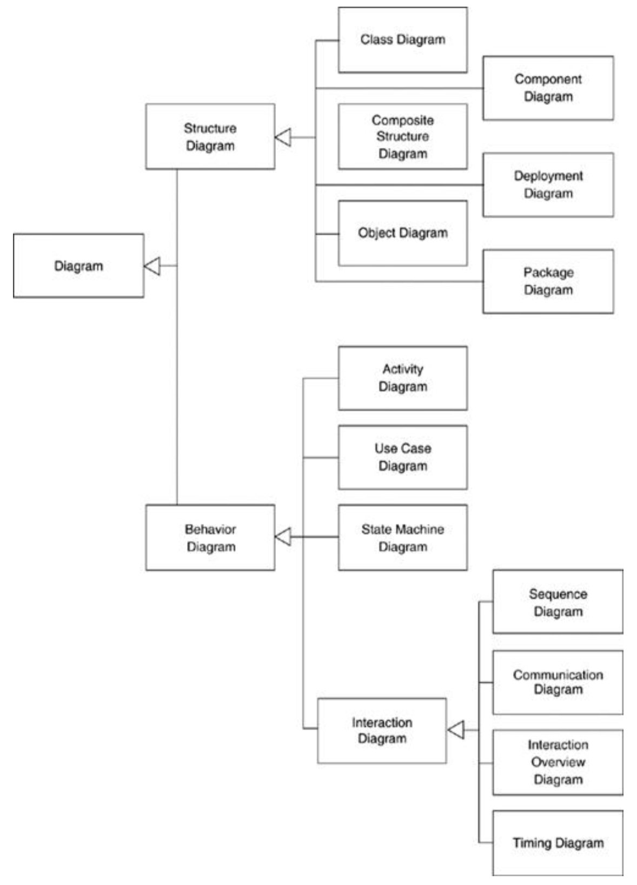

# 引言Introduction

* UML没有十分严格的定义（类似于自然语言，可能有方言，不必纠结细微的差别）
* 注重元模型meta-model，图diagrams只是元模型的一种展示

## 一、UML的使用方式

* 作为草图sketch
* 作为蓝图blueprint
* 作为编程语言programming language

### 1.1、草图sketch - 本书重点

* 重点在于**可选择性** - 只画出需要的内容，是用于探索的，只强调重要信息
* 不需要严格遵守UML规范
* 常用的媒介是白板、草稿纸
* 常在文档中使用（文档的重心也是交流，而非完整性）

#### 正向工程&逆向工程

* 用于正向工程Forward Engineering：在编写代码前画出UML图
  * 使用草图来帮助交流观点和替代方案
* 用于逆向工程Reverse Engineering：从已有代码中抽象出UML图 -> 便于理解当前系统
  * 帮助解释系统的一部分是如何运行的，只选择重要和值得讨论的类

### 1.2、蓝图blueprint

* 重点在于**完整性**，是确定的、全面的
* 需要使用更复杂的工具来帮助处理细节

#### 正向工程&逆向工程

* 用于正向工程Forward Engineering：设计师使用UML图给出详细的设计蓝图，该蓝图需要反应所有的设计决策，能够让码农无脑写出代码
  * 通常是给出详细的接口规范
* 用于逆向工程Reverse Engineering：需要传达代码的详细信息，即可以显示每个类的细节信息

### 1.3、编程语言programming language

* UML图可以直接转化为源代码
  * 由于UML图相当于是源代码，所以不存在正向工程和逆向工程
* 需要非常复杂的工具
* UML 2提供三种状态模型作为基础
  * 交互图interaction diagrams
  * 状态图state diagrams
  * 活动图activity diagrams

#### 模型驱动架构Model Driven Architecture (MDA)

* 使用UML作为编程语言
* 将开发工作分为两部分
  * 独立于平台的模型Platform Independent Model (PIM)：和具体技术无关的UML模型
  * 特定平台的模型Platform Specific Model (PSM)：工具将PSM转换为PIM
    * PSM可以不是UML
* 若从PIM到PSM的转换过程是自动化的，那么称为编程语言，否则称为蓝图

#### 可执行UML - Executable UML

* 使用和PIM一样的独立于平台的模型
* 使用模型编译器将UML模型转换成可部署的系统
  * 基于原型archetype：描述了如何将一个可执行UML模型转换到特定的编程平台

## 二、UML图的分类

* 不用特别区分每种UML图中的元素，图之间元素的定义不是很严格，可以跨图使用元素

## 三、注意事项

* UML无法直接体现为特定的编程语言，该映射规则由开发小组自己决定
* UML不是完备的，可以在需要时定义自己的non-UML diagram
* 选择自己需要的UML图使用即可
* 不要yy缺失的信息，该信息可能是默认的，也可能由该类图特有的规则所覆盖