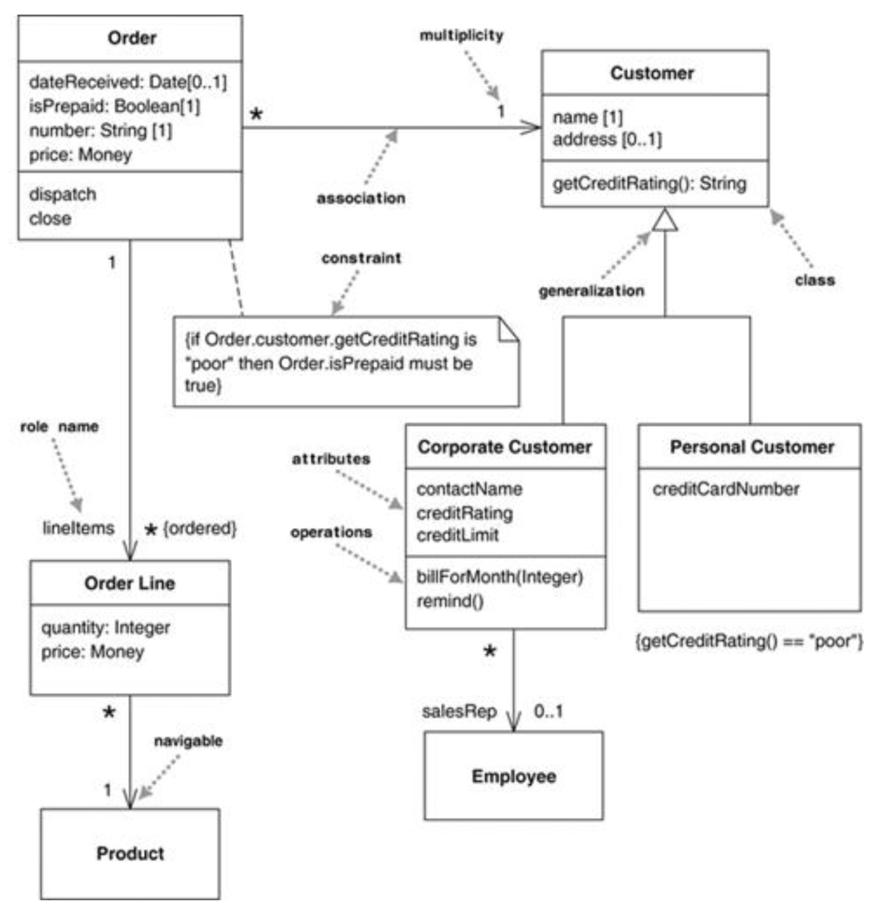
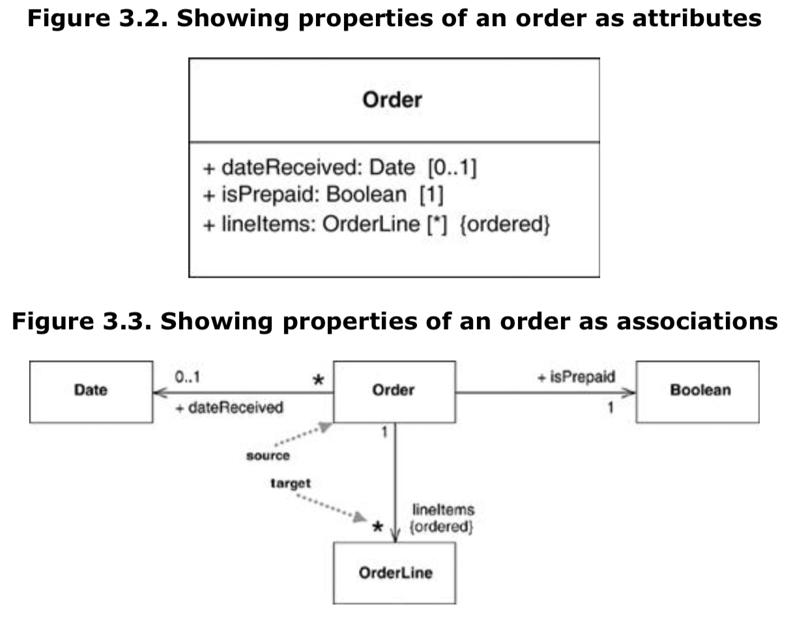
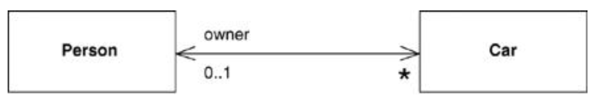
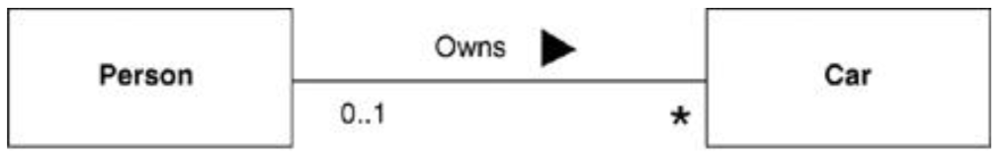
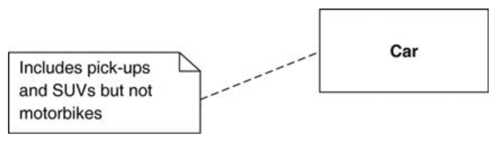

# 类图Class Diagrams (The Essentials)

* 描述了系统中**对象的类型**以及对象之间的**静态关系**
* 描述了一个**类的性质properties和操作operations**（统一表述为特征feature）
* 描述了**对象之间连接时的约束constraints**

* 类：使用方框表示，分为三部分
  * 类名name：粗体 + 首字母大写
  * 属性attributes
  * 操作operations
* 关系relationships：联系associations、泛化generalizations

## 一、类的性质Properties

* 表示**类的结构特征**
* 可通过属性attributes和关联associations两种方式体现
  * 虽然在类图上的表示不同，但**两者实际上是同一个东西**
  * 使用建议：**使用关联进行强调**
    * 使用属性表示较小的性质，如日期、布尔值等大多数值类型
    * 使用关联表示更加重要的性质，如特殊类等

### 1.1、属性Attributes

格式：`<visibility> name: <type> <multiplicity> <=default-value> <{property-string}>`

* 可见性visibility
  * `+`：公有public
  * `-`：私有private
* 属性名name ：**必有**
* 类型type
* 多重性multiplicity：表示填充对象的个数，默认为1
* 默认值defalut-value
* 属性字符串property-string：用于表示属性的额外特性
  * {ordered}/{unordered}：集合属性是否被排序，默认无序
  * {unique}/{nonunique}：集合属性中的值是否是唯一的，默认唯一

#### 多重性

* `1`：有且只有一个
* `*`：可有可无，可有多个
* `n`：有且只有n个
* `n..m`：可有n至m个
  * 下界n：0或正整数
  * 上界m：正整数或*

注：可选-下界为0，强制-下界不为0，单值-上界为1，多值-上界大于1

### 1.2、关联Associations

#### 单向关联unidirectional associations

* 两个类之间通过一条实线连接，源类通过导航箭头指向目标类
* **属性名name和多重性multiplicity位于关联的目标类一侧**
* 类型type即目标类的类名

#### 双向关联Bidirectional Associations

* 表示方式
  * 使用两个导航箭头来表示（推荐方式）
  * 省略所有箭头仅用一条实线来表示
* 命名方式
  * 和单向关联一样使用性质property命名（如owner）
  * 通过一个动词来给关联命名，必要时添加箭头来消除歧义（如owns）

## 二、类的操作Operations

类能够执行的动作，常常对应类的接口（不是方法，方法是操作的具体实现）

格式：`<visibility> name (parameter-list) : return-type <{property-string}>`

* 可见性visibility：同性质
* 操作名name
* 参数列表parameter-list：参数格式`<direction> name: type <=default-value>`
  * 方向direction：默认方向是in
    * in：进入方向
    * out：输出方向
    * inout：即可进也可出
  * 参数名name
  * 参数类型type
  * 参数默认值default-value
* 返回值类型return-type
* 属性字符串property-string：用于表示操作的额外特性
  * {query}：表示该方法不会改变系统状态，仅仅是查询数据

## 三、泛化Generalization

父类与子类的关系，注重可替代性

## 四、注释Notes and Comments

* 既可以单独出现，也可以使用虚线连接到要被注释的元素
* 可以使用在所有图中
* **行内注释：使用--表示**

## 五、依赖Dependency

* 使用虚线和导航箭头表示
* 当对一个元素的修改可能影响到另一个元素时，那么就说这两个元素之间存在依赖。类中具体表现如下：
  * 一个类向另一类个发送信息
  * 一个类拥有另一个类作为其数据的一部分
  * 一个类使用另一个类作为其操作的参数
* 尽量减少依赖的数量
* 注意循环依赖，高层次的循环依赖必须解决
  * 需要在意相互调用的两个包
  * 但不必过分在意联系紧密的两个类

| 依赖关键字  | 意义                                               |
| ----------- | -------------------------------------------------- |
| call        | 源调用目标的操作                                   |
| create      | 源创建目标的实例                                   |
| derive      | 源从目标中派生而来                                 |
| instantiate | 源是目标的实例（若源是class，那么目标是metaclass） |
| permit      | 目标允许源操作其私有特征feature（包括性质和操作）  |
| realize     | 源是目标定义的规范或接口的实现                     |
| refine      | 源是目标的细化（不同额度语义级别）                 |
| substitute  | 源可以替代目标                                     |
| trace       | 用于跟踪                                           |
| use         | 源需要目标的实现                                   |

## 六、约束规则Constraint Rules

* 格式：`{<constraint-name:> constraint}`
* UML允许使用任何东西来描述约束，只需将他们放入{}中即可
* 可以给约束起名

## 七、其他

### 7.1、代码实现

* 一个类拥有某个属性不意味着该属性一定是该类的字段，可以通过get方法返回一个**计算值**
* UML中的多值意味着集合，所以UML中不会显式表示集合

### 7.2、使用建议

* 使用尽可能少的可用符号notations
* 概念类图在探索业务语言时十分有用，所以需要尽量使符号notations简单，将软件排除在讨论范围之外
* 只画出关键模型即可，不要为所有东西绘制模型
* 保持更新

