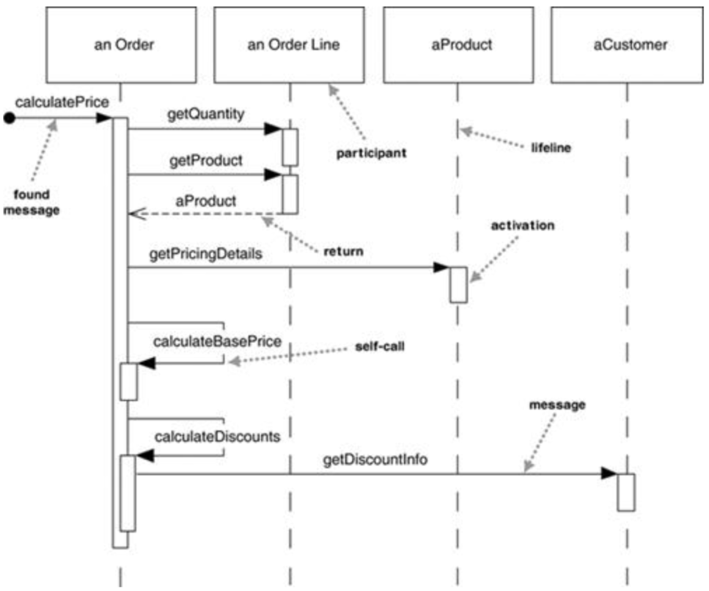
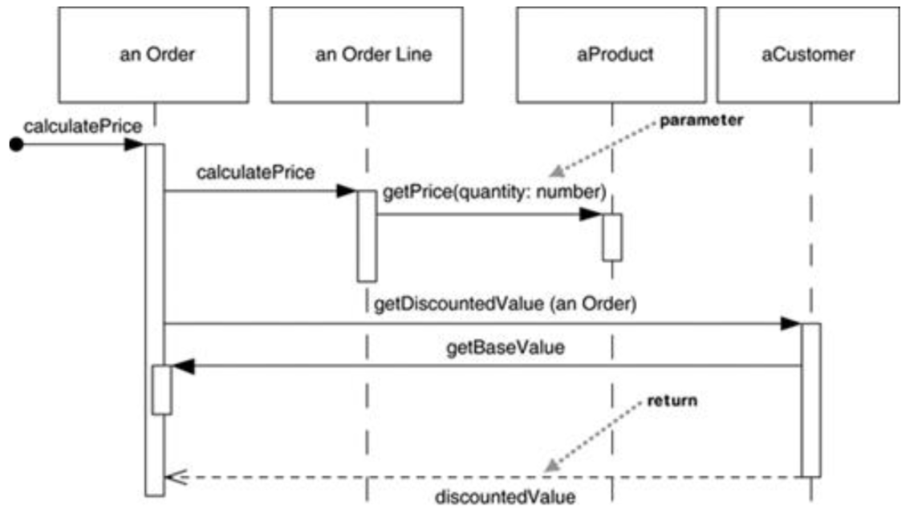
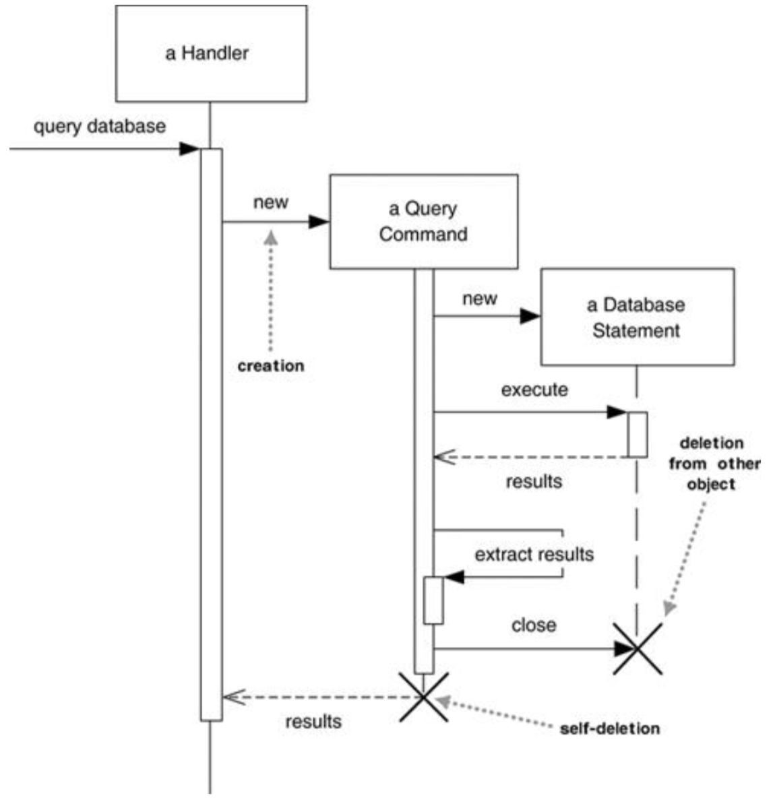
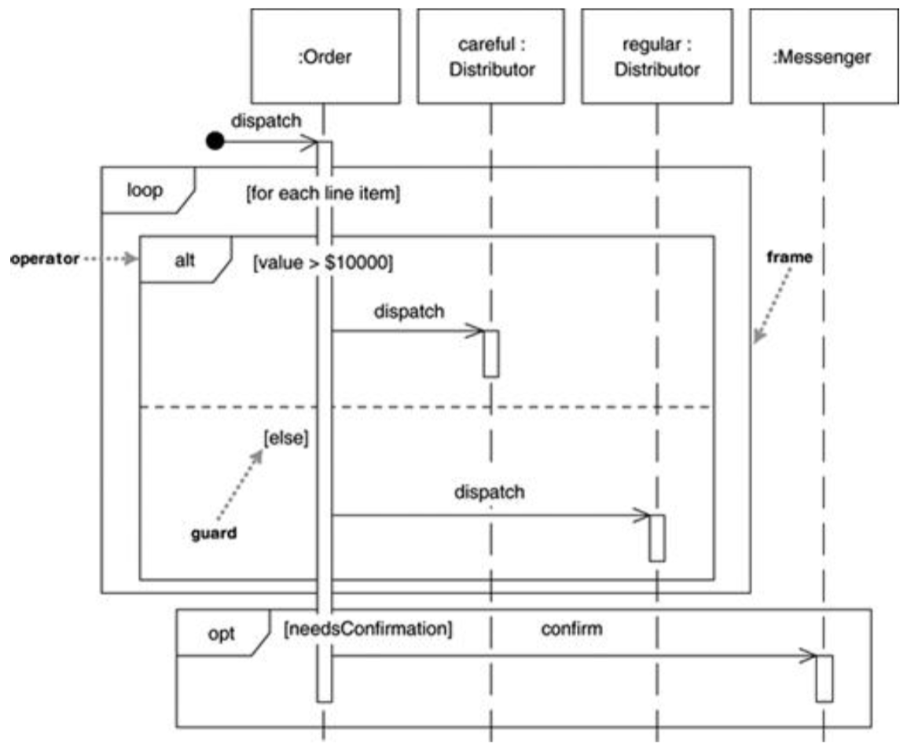
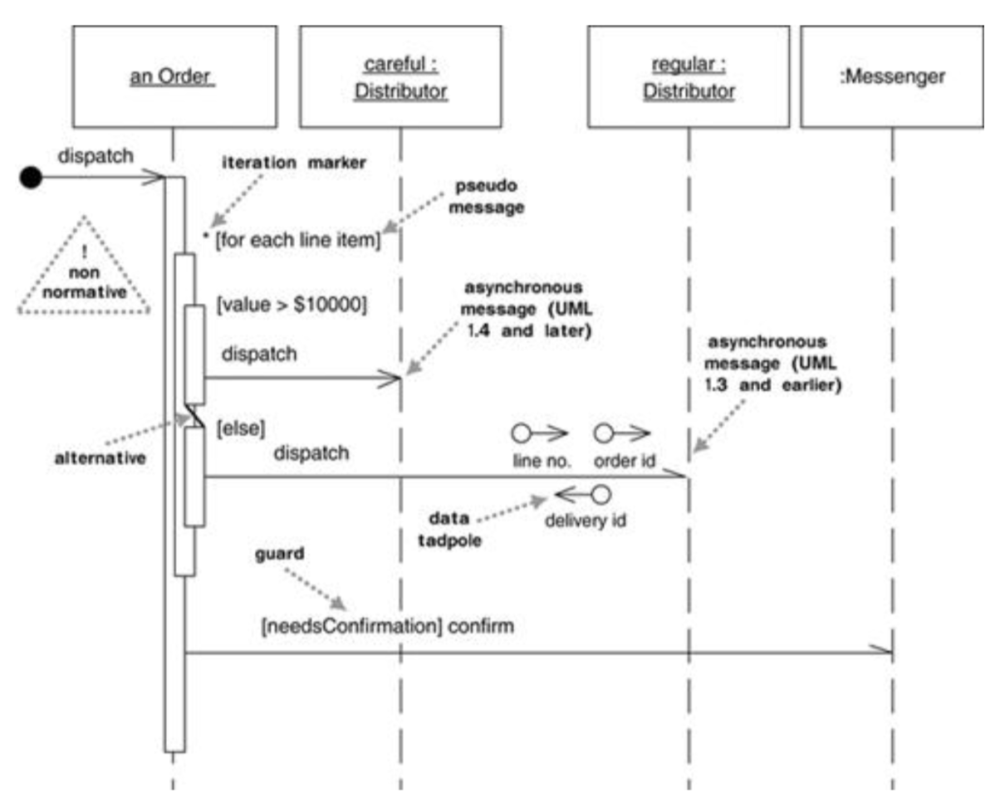

# 序列图Sequence Diagrams

也称时序图、循序图

## 一、简介

### 集中控制centralized control

### 分散控制distributed control(推荐)

* 参与者participants：使用方框表示，格式为`<name> <:class>`
  * 在UML1.0中所有参与者都是对象，但在UML2.0中参与者的角色变得更加复杂（自己研究），所以本书使用参与者participants这个不是规范表达的词
* 生命线lifeline：每个参与者对应一个，使用虚线表示
* 激活栏activation bar：使用竖着的细窄长方形表示
  * 显示参与者何时在交互中处于活动状态
  * 一个激活栏对应一个方法调用
  * 当方法调用嵌套时，可以在激活栏上再画一个激活栏
* 消息message：实线 + 实心箭头 + 消息名，相当于一个方法调用
  * **发现消息found message**：第一条消息，来源不确定，没有具体的参与者 -> 使用小圆点作为开始
* 返回消息return message：可有可无，建议只有在该方法调用添加信息时才画出

## 二、创建和删除参与者Creating and Deleting Participants

### 2.1、创建参与者

* 使用叉表示删除
* 删除方式
  * 自我删除：直接在生命线结尾标上叉
  * 被他人删除：通过消息连接到叉
* 在GC机制中，也常常标上叉来表示该参与者不再被使用

## 三、循环、条件等Loops, Conditionals, and the Like

* 控制逻辑不是序列图想表达的重点，序列图的重点在于展示参与者间的交互（一般使用活动图表达控制逻辑）
* **互动框interaction frames**：标记序列图一部分的方式，可用来表示循环和条件

### 3.1、互动框interaction frames

* 每个框frame都有一个操作符operator，每个片段fragment都有一个看守guard
  * 互动框frame：由序列图的某个区域构成，该区域被分割成一个或多个片段fragments
  * 片段fragment：互动框内时序图的细分
  * 操作符operator：用于标识对框内所有片段的操作
  * 看守guard：用于判定是否执行对某个片段的操作

### 3.2、常见操作符operators

| operaotr                             | meaning                                                      |
| ------------------------------------ | ------------------------------------------------------------ |
| alt (alternative multiple fragments) | 框内片段是可相互替代的。只有guard为真的片段会被执行          |
| opt (optional)                       | 框内片段是可选的。只有guard为真时，框内片段才会被执行（和只有一个片段的alt等价） |
| loop (loop)                          | 框内片段可能循环执行多次。guard被用于控制循环                |
| par (parallel)                       | 框内片段是并行的。所有片段并发执行                           |
| region (critical region)             | 框内片段是关键区域。同时只能有一个线程执行该框内片段         |
| neg (negative)                       | 用于展示无效的交互关系                                       |
| ref (reference)                      | 指向另一个表上的交互关系，可以自定义参数和一个返回值。需要覆盖交互中的生命线 |
| sd (sequence diagram)                | 用于包裹整个序列图（其实没必要）                             |

### 3.3、UML1.0中的逻辑控制

* iteration marker：在消息名前添加星号*。在方括号[]内添加迭代进行的基本条件
* guards：放在方括号[]内的条件表达式，只有当guard为true时消息才会被发送
* **伪消息pseudo message**：一个消息通常只能对应一个刺激activation，但伪消息解决了该问题
  * 通常不添加消息箭头 -> 便于辨认该消息是伪消息
* **激活框的隐藏**：当发送消息后消息接收者在其激活期内不做出任何行为时，可以直接隐藏激活框，如dispatch方法

## 四、同步消息&异步消息

* 同步消息：使用实心箭头表述，消息发送方必须等待消息结束
* 异步消息：使用鱼骨/半鱼骨箭头表述，消息发送方无需等待消息结束，继续执行

注：若作者不显式区分，有些时候也会使用鱼骨箭头表示同步消息（一定要注意，不要妄加猜测）

## 五、序列图的使用时机

* 序列图：适用于查看一个用例中多个对象的交互行为
* 状态图：适用于查看一个对象在不同用例中的行为
* 活动图：适用于查看跨越多个用例和线程的行为
* 通信图communication diagrams：适用于展示连接
* 数位时序图timing diagrams：适用于展示时间上的约束

### 5.1、CRC card (Class-Responsibility-Collaboration card)

* 便于修改，适合快速探索多种交互方式 -> 先试用CRC card探索，再使用序列图捕获所需要的所有交互
* 适用于面向对象设计，给出一个较高层次的抽象
* **一定要在交流中产生**，card的目的便是便于传递与交流

* 职责responsibility：概括对象应该执行的操作（专注于重要职责，不要太多）
  * 对象的行为 - 操作
  * 对象维护的知识 - 属性
  * 对象做出的重要决策
* 协作collaboration：为实现某一职责需要和哪些类协同工作