# 类图Class Diagrams(Advanced Concepts)

## 一、关键字Keywords

通过标明关键字，来表示自己虽然使用了UML图中存在的元素，但该元素表达了相近却不同的含义

* 通常使用`«»`或`{}`标明关键字
  * `«interface»`：接口，通常简写为`«I»`
  * `{abstract}`：抽象，通常简写为`{A}`

## 二、分类和泛化Classification and Generalization

* 分类classification：即实例化，代表一个对象和其对应的类型之间的关系
  * 不可传递
  * UML表示：使用`«instantiate»`关键字标记依赖
* 泛化generalization：即子类型，可传递
  * UML表示：使用泛化标记，即实线 + 空心箭头
  * 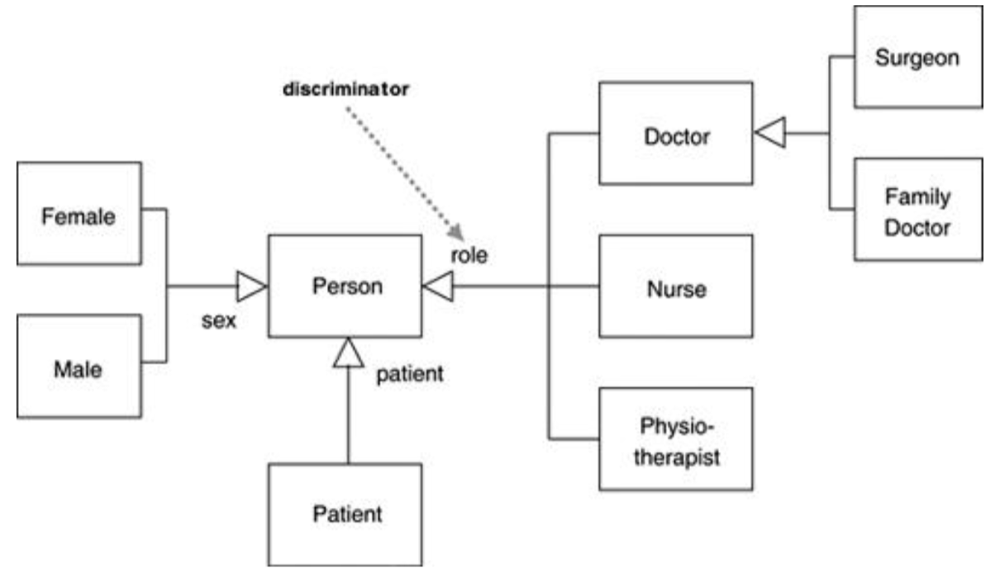
    * 描述符discriminator：用于描述一个泛化集合
    * 泛化集合generalization set：对应一个分类classification，默认不相交

## 三、多分类&动态分类Multiple and Dynamic Classification

### 3.1、多重分类

* 单分类single classification：一个对象只属于一个类型
* 多分类multiple classification：一个对象属于**位于不同泛化集合**的多个类型
  * 多继承 vs. 多分类
    * 多继承：一个类型可能有多个基类型，但是每个对象都只对应一个单一类型
    * 多分类：一个对象可以在没有定义一个专门类型的情况下属于多个类型

### 3.2、动态分类

* 动态分类dynamic classification：允许对象改变其所属的类，将状态和类型结合
* 静态分类static classification：不允许对象改变其所属的类
  * UML图默认使用静态分类（图无法跟随状态而改变）

## 四、关联类Association Class

* 用于描述关联关系的类，可以为关联添加属性attirbutes、操作oprations和其他特征features
* 格外的约束：**两个对象之间只能存在某个关联类的一个实例**（关联关系没有此约束）

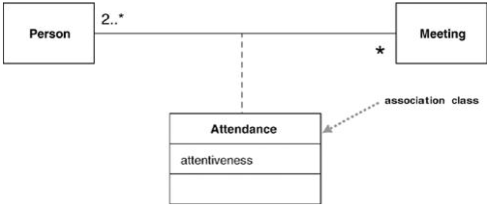

### 4.1、将关联类转换为完整的类

* 注意多重性multiplicities的变化

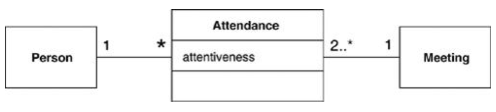

### 4.2、关联类的代码实现

* 思路：将关联类当作完整的类来实现，并提供获取被关联对象信息的方法
* 注意事项：注意确保两个对象间关联类对象的唯一性

### 4.3、改进

* `«temporal»`关键字：表示该关联关系具有时间信息
  * 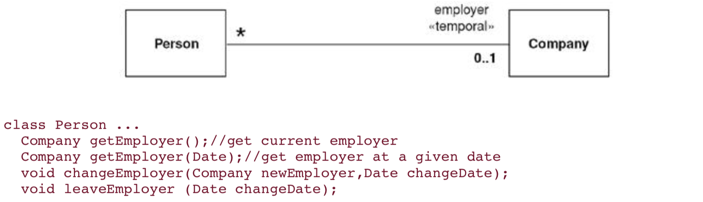

## 五、模板类Template(Parameterized) Class

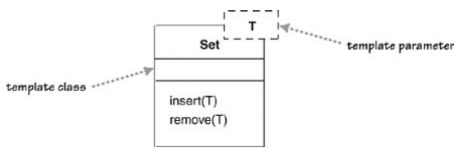

* 虚线框中的T：类型参数的占位符，可以有多个
* 其余和正常类相同

### 5.1、绑定元素的方式

#### 方式1

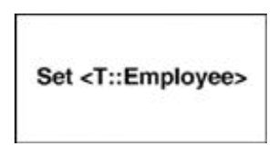

* 格式：`class-name<parameter-name::parameter-value>`
* 多个被绑定的元素间用逗号隔开

#### 方式2

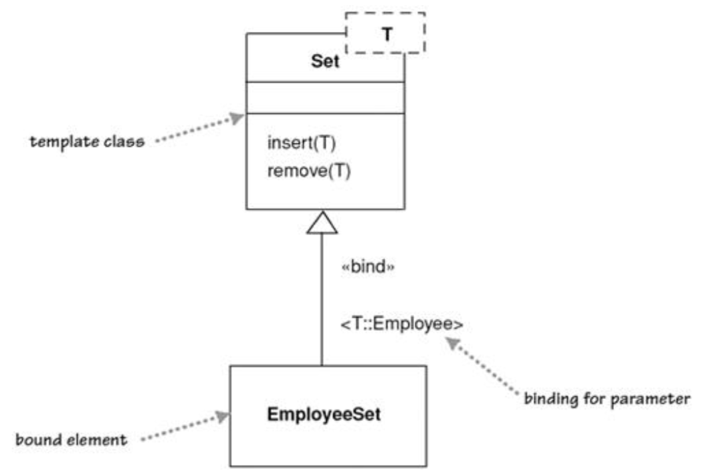

* 使用`«bind»`关键字和泛化关系（实线 + 空心箭头），并在线上标明被绑定元素的类型
* 能够为被绑定的元素重命名
* 可将上图中的EmployeeSet看作是Set的子类

## 六、枚举Enumerations

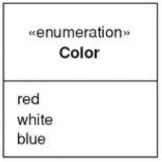

* 使用`«enumeration»`关键字
* 除符号值外无其他任何性质

## 七、活动类Active Class

活动类的定义：拥有实例，每个实例都执行并控制自己的控制线程

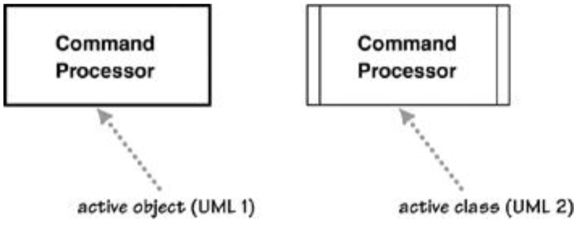

* UML1.0：将边框加粗
* UML2.0：在两边加上竖线

## 八、可见性Visibility

* 用于标记特征（性质和操作）
* 可见性指示符：**和具体语言有关**，使用时遵循相应语言的语法
  * `+`：public
  * `-`：private
  * `~`：package
  * `#`：protected
* 使用建议：只有在需要强调不同特征（性质和操作）的可见性的时候才写

## 九、消息Messages

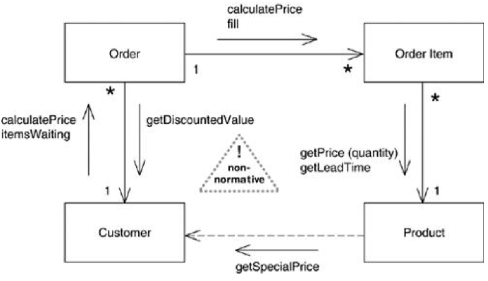

* 非标准UML
* 在关联关系上加上箭头，箭头上附有传递的消息
  * 可能需要添加依赖关系来显示未被关联的类之间的关系（依赖关系上也可附加消息）

## 十、职责Responsibilities

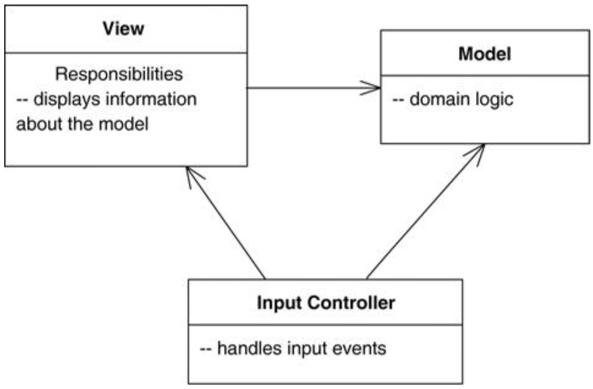

* 使用行内注释--来说明类的职责

## 十一、静态操作和属性Static Operations and Attributes

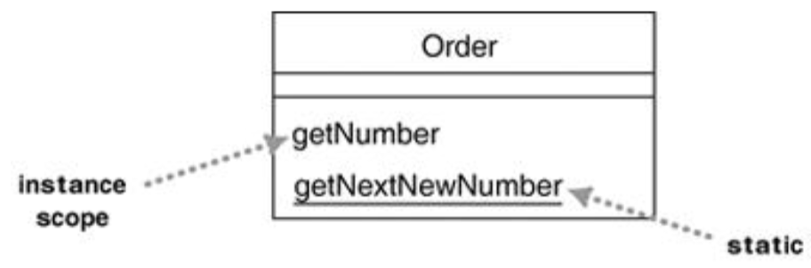

* 使用下划线表示属于类的操作和属性

## 十二、聚合和组合Aggregation and Composition

### 12.1、聚合Aggregation

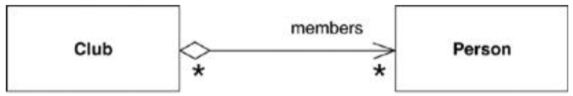

* 表示part of关系，**和关联关系类似，不必强行区分**
* 注意事项
  * 可以说是无意义的，自己尽量不要使用
  * 注意其他人的使用方式，不同的人有不同的意义

### 12.2、组合Composition

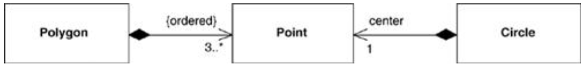

* **不共享原则**：被组合类可能是多个其他类的组成部分，但其的**一个实例只能有一个所有者**
* **生命期相同**：**被组合实例和其所有者的生命期相同**，即所有者消亡后被组合实例也随之消亡

## 十三、衍生性质Derived Properties

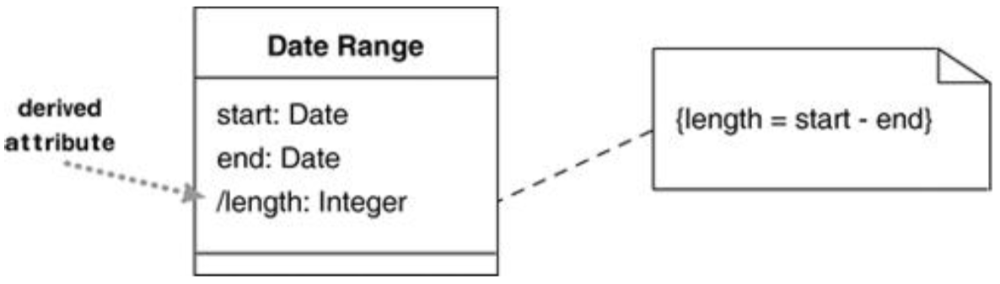

* 定义：可由其他值间接计算得到
* UML表示：在属性名前使用斜杠`/`标识，可通过注释标识值之间的约束

## 十四、接口和抽象类Interfaces and Abstract Classes

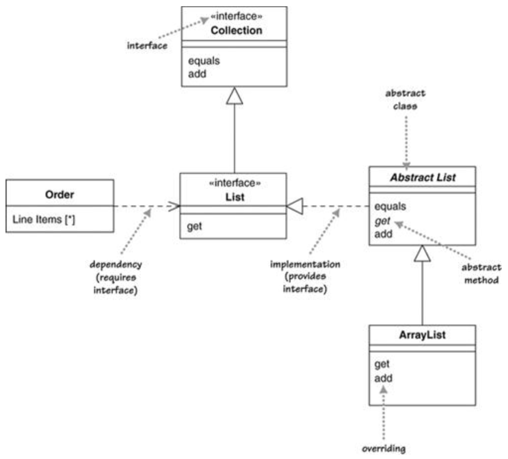

### 14.1、抽象类

* 定义：不可被直接实例化的类，必须含有抽象操作，即没有实现的操作
* UML表示：
  * 使用*斜体*（手写时不易分辨）
  * 使用`{abstract}`关键字

### 14.2、接口

* 定义：没有实现的类（所有feature特征都是抽象的）
* UML表示：使用`«interface»`关键字

### 14.3、面向接口编程的UML表示

* 提供某一接口provides an interface：一个类实现了哪些接口
* 需要某一接口requires an interface：一个类需要哪些接口的实例才能工作

#### a. Ball-and-socket notation（推荐方式）

* 球/棒棒糖符号lollipop：用于该类说明实现了哪些接口
  * 也可用于其他图中，用于更好地表示多态
* 插口符号socket：用于说明该类需要哪些接口

#### b. Older dependencies with lollipops（旧方式，不推荐）

* 使用依赖来说明需要哪些接口（和上一个方式中的socket起到相同的作用）

## 十五、只读和冻结Read-Only and Frozen

* 只读：使用`{readOnly}`关键字，表示用户只能访问某一性质property而不能更改（可由对象自己修改）
* 冻结：使用`{frozen}`关键字，表示某一性质property在对象生命周期内都不能被修改

## 十六、引用对象和值对象Reference Objects and Value Objects

* 引用对象
  * 相同对象通常只需要一个实例
  * 比较对象是否相同只需比较引用即可
* 值对象：使用`«value»`和`«struct»`关键字
  * 相同对象通常有多个实例
  * 比较对象是否相同需要比较具体的值
  * **值对象应该是不可变的** -> 若需要使用不同的值，直接新建新对象，而不是修改原对象

## 十七、条件关联Qualified Associations

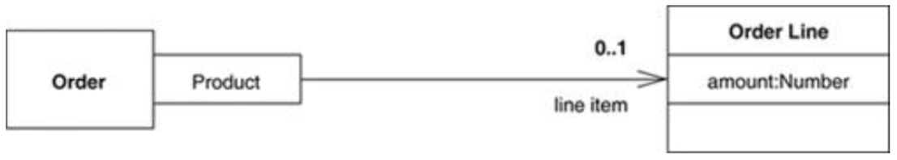

* 使用限定符qualifier表示两个类之间的关联关系
* 用于表示关联关系的多重性 -> 转化成限定符的多重性
* 类似于键值对，对每个键有一个关联（如图中Order对每个Product有0..1个OrderLine）

