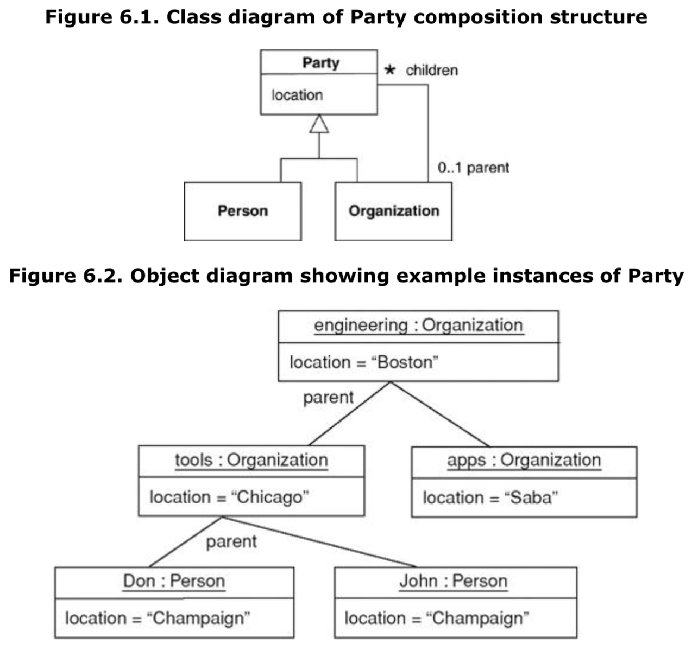

# 对象图Object Diagrams

某一时刻系统中对象的快照

* 别名：实例图instance diagrams
* UML表示：
  * 对象名name：
    * 格式：`<instance-name> <:class-name>`
    * **使用下划线标识**
* 对象图中的对象只需满足实例规范instance specification即可，不需要是真正的实例（可理解为部分定义的实例）
  * 使用抽象类的实例是合法的
  * 必填属性为空是合法的
* 也可使用没有消息的通信图communication diagrams来描述对象图
* 使用场景：在展示互相连接的对象时很有帮助
  * 用于帮助理解类图的结构（如帮助理解下图的组合模式）

