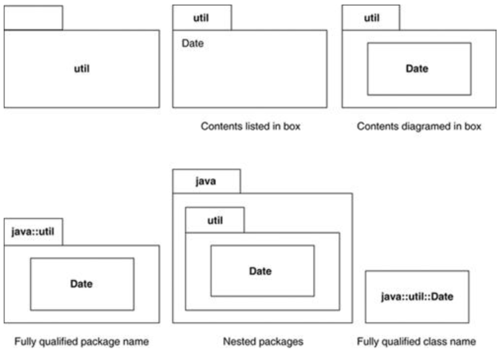
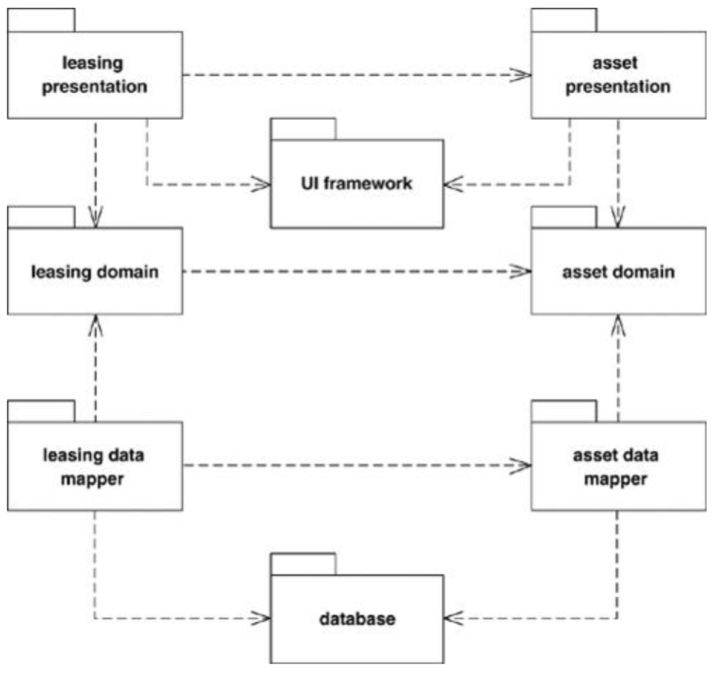
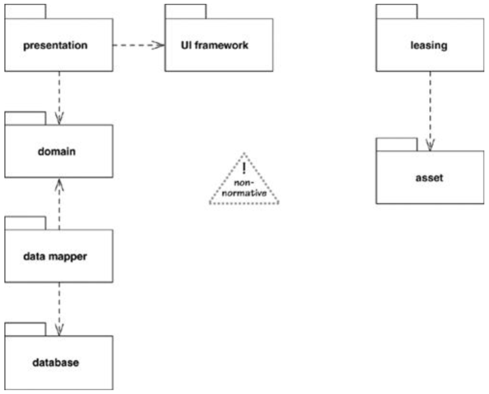
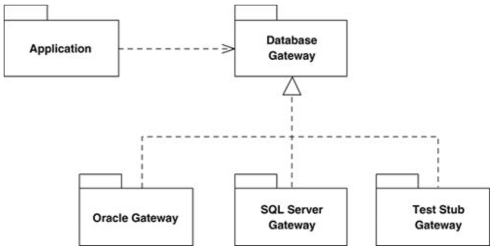

# 包图Package Diagrams

* 共同封闭原则Common Closure Principle：包中的类应该为同一个原因发生变化
* 共同重用原则Common Reuse Principle：包中的类应该一起被重用（单一职责）
* 无环依赖原则Acyclic Dependency Principle：将循环局部化，绝对不能有跨层的循环
* 稳定依赖原则Stable Dependencies Principle：一个包被依赖的次数越多，则其接口需要越稳定
* 稳定抽象原则Stable Abstractions Principle：越稳定的包中的接口和抽象类越多

## 一、基本概念

* 包package：将UML中的**任何元素**分组归类到更高层次的单元中（通常用于类class）
  * 包可以包含子包subpackages和类classes
  * 每个包都对应一个命名空间namespace -> 包内类名必须是唯一的
    * 可通过::写出完全限定名来指定某一个类（如java::util::Date）
* UML表示：签名文件夹tabbed folder
  * 左上角小方框：包名
  * 中间大方框：包中内容，即可直接写出包名/类名，也可画图（可使用类图）
* 包的接口：包中的public类构成了包的接口（private类被隐藏）
  * 使用外观模式Facade，将所有类都变成私有类，提供额外的外观类作为接口，并将任务委托给私有类
* **包的划分原则**：
  * 共同封闭原则Common Closure Principle：包中的类应该为同一个原因发生变化
  * 共同重用原则Common Reuse Principle：包中的类应该一起被重用（单一职责）

## 二、包和依赖Packages and Dependencies

* 包图：用于展示包以及各个包之间的依赖
* 包之间的依赖：可概括为包中内容之间的依赖 -> 包1中任何一个类依赖包2中的类则说明包1依赖包2
  * **依赖不具有传递性**
  * 当一个包被非常多的包依赖时，使用`«global»`关键字标记该包，删除所有依赖标记 -> 减少依赖标记的数量，让包图更加清晰
* **包的依赖原则**：
  * 无环依赖原则Acyclic Dependency Principle：将循环局部化，绝对不能有跨层的循环
  * 稳定依赖原则Stable Dependencies Principle：一个包被依赖的次数越多，则其接口需要越稳定
  * 稳定抽象原则Stable Abstractions Principle：越稳定的包中的接口和抽象类越多

## 三、看待包的视角Package Aspects

* 可从以下两个角度aspect来看待“二”中的包图
  * presentation, domain, data mapper, and database
  * leasing and assets
* 非规范的，目的仅仅是帮助理解

## 四、实现抽象包Implementing Packages

* 一个包定义了抽象接口，由其他包提供具体实现

## 五、使用场景When to Use Package Diagrams

* 显示大型系统中主要元素间的依赖关系
* 包图用于在编译时刻分组，组合结构图composite structure diagram用于在运行时刻分组