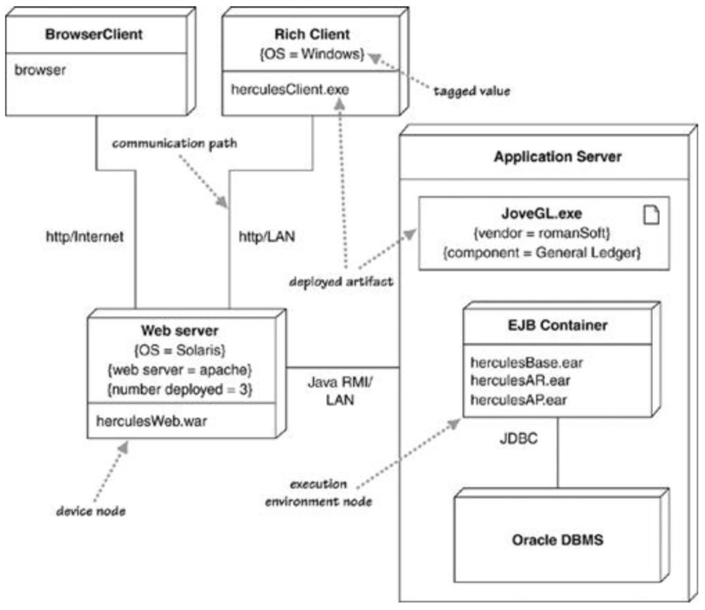

# 部署图Deployment Diagrams

展示系统的物理布局，显示软件的各部分在哪些硬件上运行

## 一、基本概念

* 节点node：用于托管软件，分为以下两类：
  * 设备device：硬件，如计算机等
  * 运行环境execution environment：可托管或包含其他软件的软件，如操作系统等
* 产品artifact：软件的物理表现，通常为可执行文件，有以下两种表示方式
  * 类盒class boxes：使用文档图标或`«artifact»`关键字表示（上图中的JoveGL.exe）
  * 直接将产品名列在节点中
* 标记值tagged value：用于额外说明节点或产品的信息，使用{}说明，如下面的几个标记值：
  * number deployed：共同完成同一任务的物理节点数量
  * component：说明产品实现了哪一个组件
* 交互途径communication path：说明交互方式，如通信协议等

## 二、使用场景

* 适合用于说明何物被部署在何处
* 重要的部署都需要有部署图