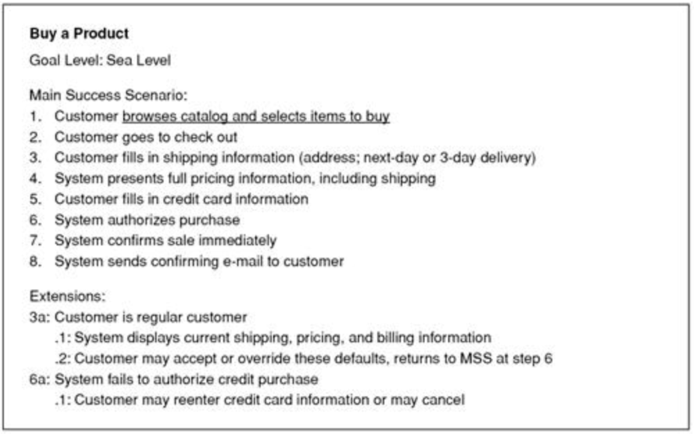
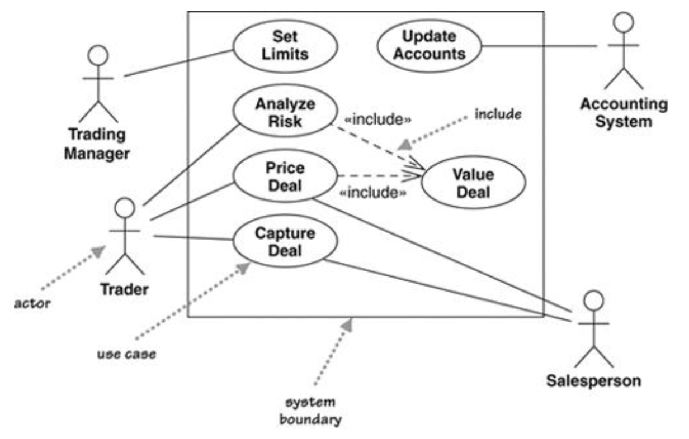

# 用例Use Cases

## 一、基本概念

* 场景scenario vs. 用例use case
  * 场景scenario：描述用户和系统交互的一系列步骤
  * 用例use case：用户目标相同的一组场景
* 角色actor/role：用户user在系统中扮演的角色
  * 一个角色可以执行多个用例，一个用例也可被多个角色执行
* 用例的作用：揭示系统的功能需求，并描述系统用户和系统的典型交互，说明系统的使用方式
* **用例的重要性在于内容而不是用例图**（用例图包含的信息是有限的）

## 二、用例的内容Content of a Use Case

### 2.1、用例的一种结构

* 目标等级goal level：见“四”，分为sea level（多）、fish level、kite level
* 主要成功场景main success scenario：用于描述最常见的成功场景
* 补充场景extensions：在主要成功场景的基础上描述其他场景，既可以是成功的，也可以是失败的
  * 标明补充场景开始的步骤并提供条件condition的简短描述
    * 条件condition：用于描述该补充场景和MSS的主要区别
  * 若想要返回MSS继续执行，则需要特别说明返回MSS中的哪一步
* 其他信息
  * 前提条件pre-condition：在用例开始前系统需要保证正确的条件
  * 保障guarantee：在用例结束时系统需要保证正确的条件
    * success guarantees：仅适用于成功的用例
    * minimal guarantees：适用于所有用例
  * 触发器trigger：说明触发用例开始的事件

### 2.2、补充说明

* 角色
  * 主要角色：用例的目标满足对象，但不一定是用例的发起者
  * 次要角色：用例执行时的其他参与者
* 用例中的每个步骤需满足：
  * 说明是**谁**在执行该步骤
  * 说明角色的**意图**，而**不是具体的行为机制**
    * 注意不能描述用户界面，用户界面是在用例之后确定的
  * **可以是另外一个用例**（用下划线说明 -> 类似超链接）
* 注意事项
  * 保证用例简短并易于阅读
  * 用例中细节信息的多少取决于用例的风险程度大小
  * **早期只需要关键需求的详细信息，其他需求在实现前再另行扩充**
  * 注重口头交流

## 三、用例图Use Case Diagrams

用例图不是必须的，而应该**将工作重心放在用例上**

* 某个角色执行哪些用例
* 某个用例包含哪些其他用例 -> 使用`«include»`关键字

* 用例use case：使用椭圆表示
  * 用例间可能有include关系（注意不要过分注意用例间的其他关系，这些关系并不重要）
* 系统边界system boundary：使用方框将用例和角色隔开
* 角色actor：使用小人表示

## 四、用例的等级Levels of Use Cases

### 4.1、系统用例&业务用例

* 系统用例system use cases：与软件交互
* 业务用例business use cases：与客户或事件交互，描述业务如何回应客户或事件

### 4.2、用例的等级

* 海等级sea level：主要角色和系统间的离散交互，通常是系统用例（多为此等级）
* 鱼等级fish level：组成“海等级”用例的用例，通常是系统用例
* 风筝等级kite level：描述“海等级”用例如何适应更广泛的业务交互，通常是业务用例

## 五、用例和功能Use Cases and Features (or Stories)

* 用例和功能均用来描述需求，但两者目的不同
* 一般先开发用例，再生成功能列表
* 功能可以是整个用例、用例中的一个场景、用例中的一步或其他变种行为 -> 功能的粒度更细

## 六、使用场景When to Use Use Cases

* 帮助理解系统的功能需求
* 应尽早进行用例的第一次开发，并且只专注于关键用例，其余非关键用例在开发前再扩充
* 用例提供的是系统的外部视角，所以不要考虑用例和系统内部的类之间的关联关系
* 将工作重心放在用例的内容上，而不是用例图上
* 保证用例简短并易于阅读（不要过于冗长）