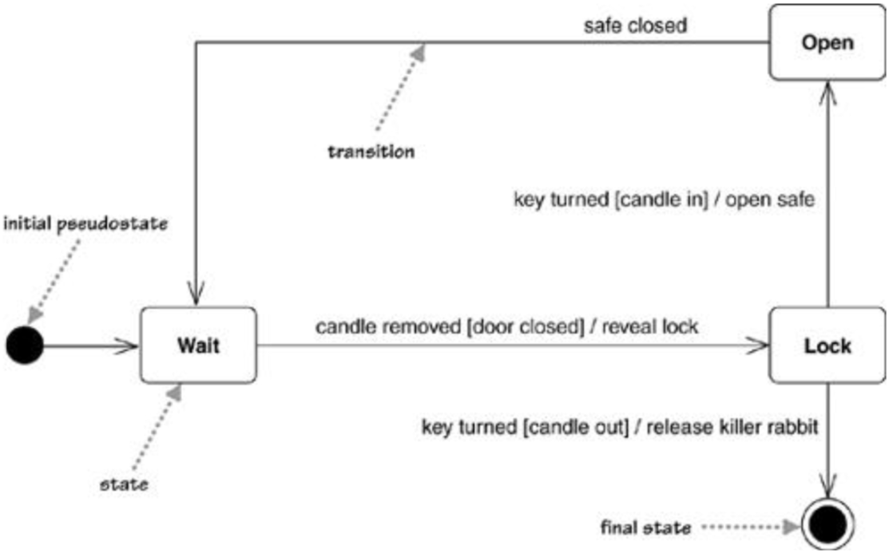
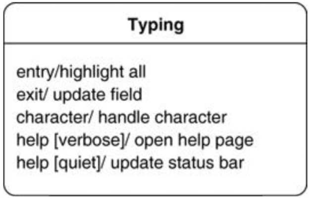
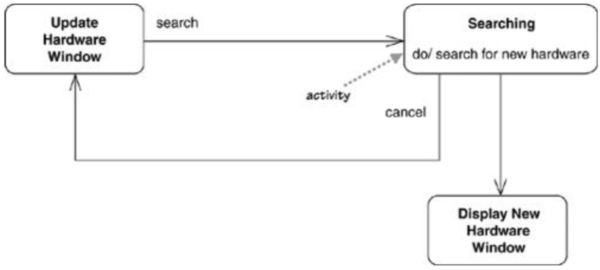
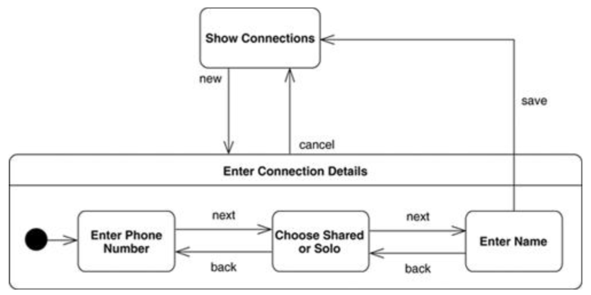
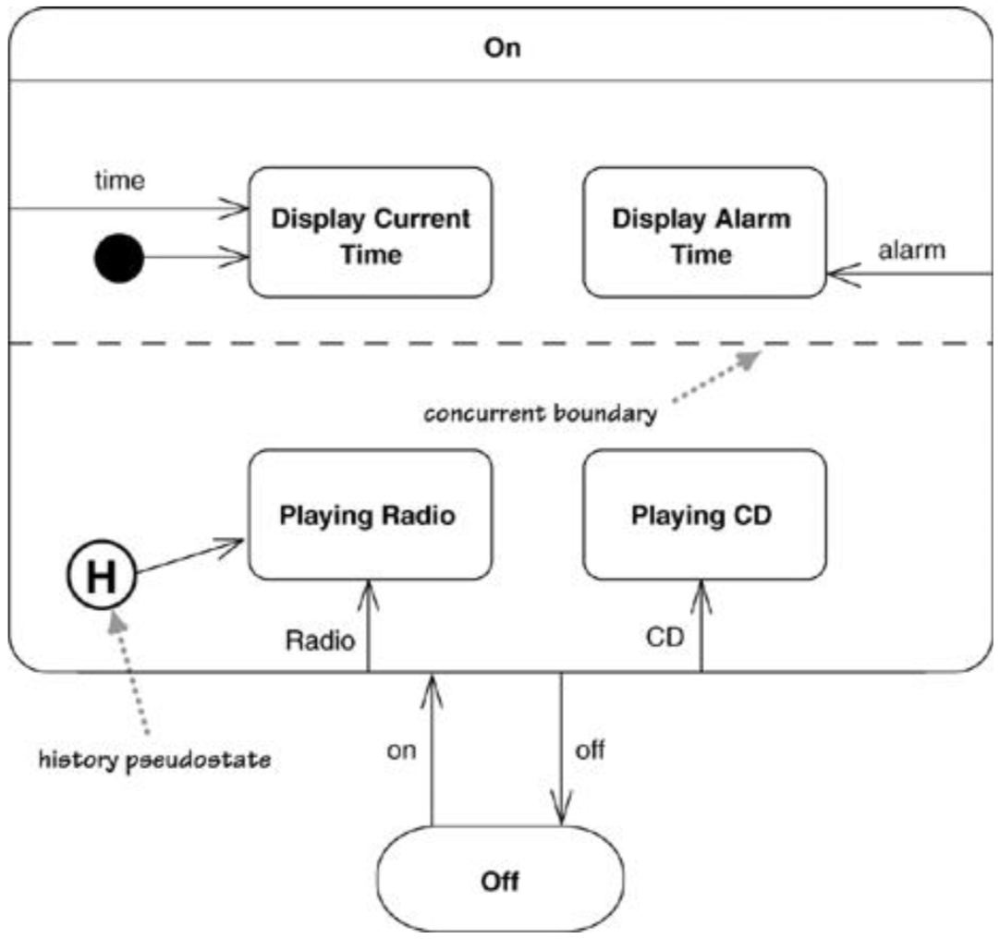

# 状态机图State Machine Diagrams

* 用于描述系统的行为
* 在面向对象方法中，通常为单个类绘制状态机图以显示单个对象在其生命周期内的行为

## 一、基本概念

* 状态state：不同的状态意味着对事件作出反应的不同方式。使用圆角矩形表示
* 初始伪状态initial pseudostate：不是状态，但使用箭头指向初始状态。使用实心圆表示
* 终止状态final state：使用实心圆+圆环表示
* 状态转移transition：说明状态转移的规则
  * 格式：`{trigger-signature} {[guard]}{/activity}`，均为可选的
    * 触发事件trigger-signature：可能触发状态改变的单个事件
    * 守卫guard：状态转移必须满足的条件
    * 活动activity：状态转移期间执行的行为
  * 转移成分的缺失
    * 缺失trigger-signature：到达该状态后立马进行此状态转移（少见）
    * 缺失guard：当事件发生时总是进行状态转移
    * 缺失activity：在状态转移期间不执行任何行为

## 二、内部活动Internal Activities

将状态转移`{trigger-signature} {[guard]}{/activity}`放入状态内部

* 在不进行状态转移的情况下响应事件
* 类似于self-transition，从自己转移到自己

## 三、活动状态Activity States

* 活动状态activity state：在活动状态中，对象一直处于工作状态执行某项任务
  * UML表示：使用`do/`标记 -> “做”活动do-activity
* 当活动状态的活动结束时，会进行状态转移，该转移transition不需要触发事件（即默认触发事件是该状态执行的活动结束）
* 普通活动regular activities vs. “做”活动do-activity
  * 普通活动：立即完成，不能被打断
  * “做”活动：持续一段时间，可以被打断

## 四、超级状态Superstates

* 问题：多个状态有相同的状态转移和内部活动
* 解决方法：提取出一个超级状态，让这些状态成为超级状态的子状态，并且超级状态拥有这些状态共享的行为

## 五、并发状态Concurrent States

* 状态可以分解为多个同时运行的正交状态图
  * 不同正交状态图使用虚线分割
  * 同一正交图中的状态不可并发执行，不同正交状态图中的状态可以并发执行
* 历史伪状态history pseudostate
  * 再次进入该状态时，恢复为上次退出时的状态
  * 当没有历史状态时，即第一次进入时，状态为历史伪状态指向的状态

## 六、状态图的代码实现Implementing State Diagrams

* 嵌套的switch case语句nested switch
* 状态模式state pattern：使用抽象的状态接口
* 状态表state table：将状态图信息转化为数据

## 七、使用场景When to Use State Diagrams

* 适合统一描述一个对象跨越多个用例的行为
* 不适合描述多个对象的协作 -> 和其他图相结合
* 仅需给行为特殊的对象画出状态图，如UI和控制对象