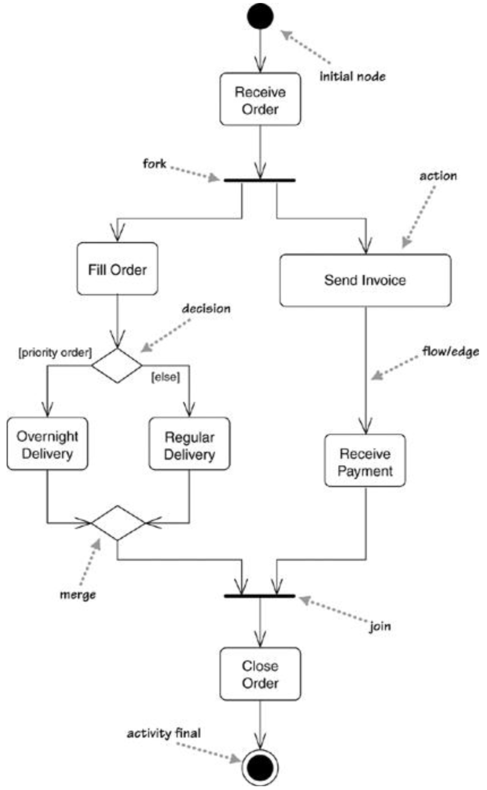
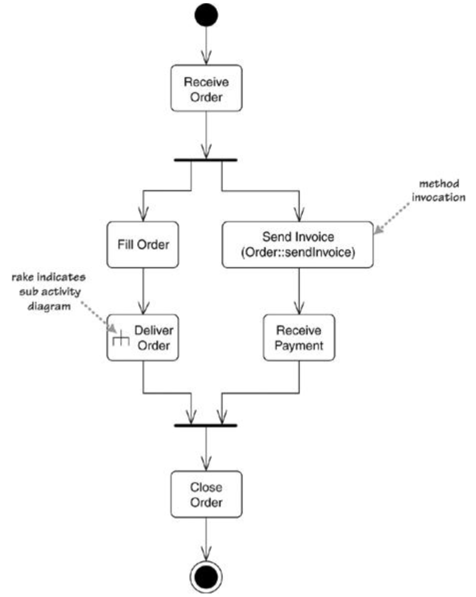
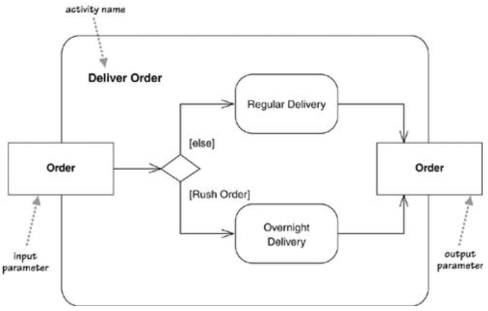
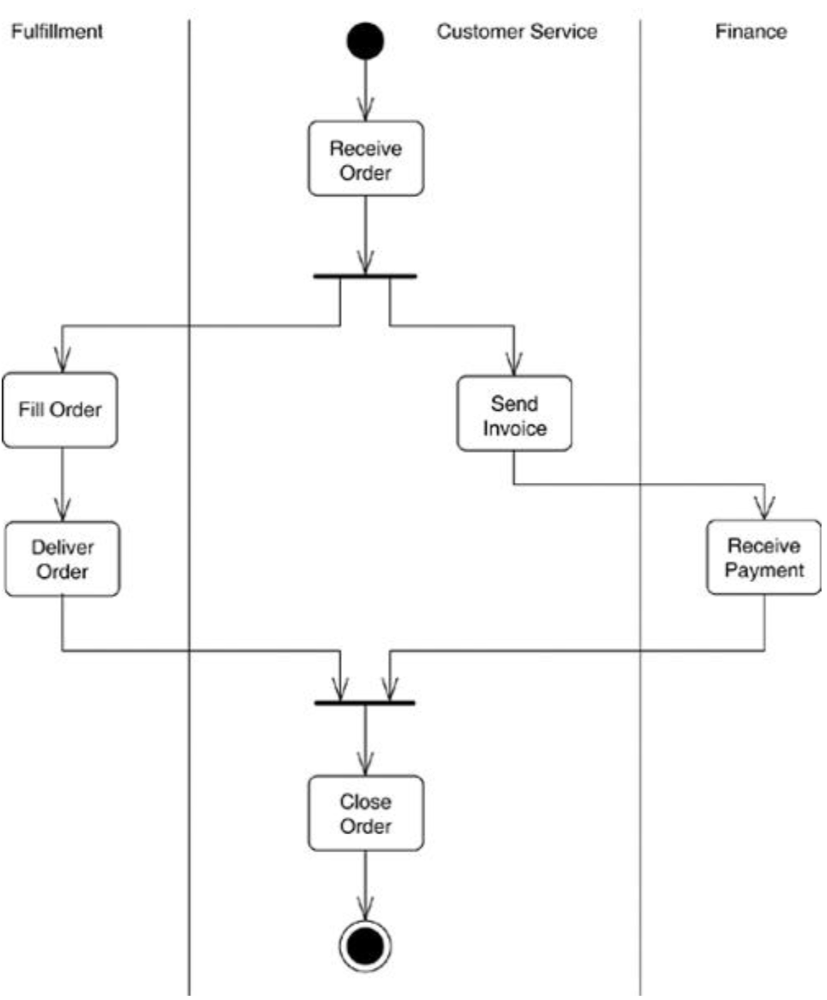
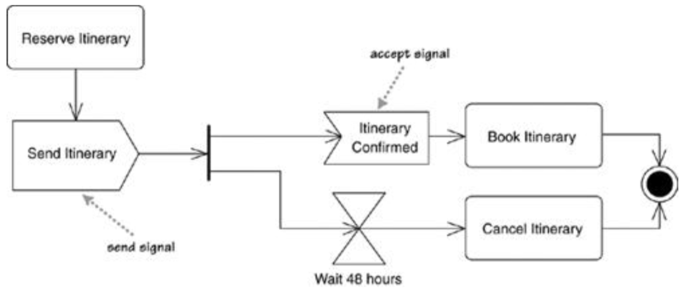
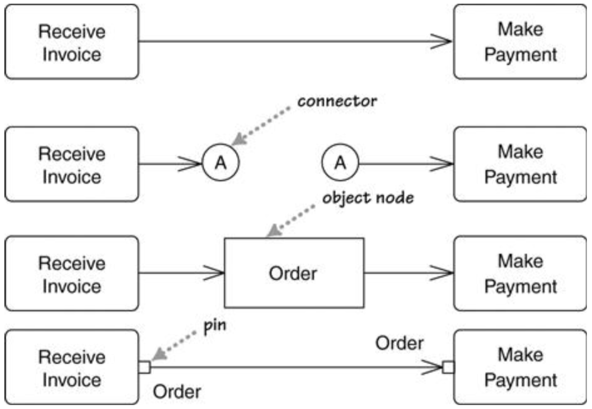
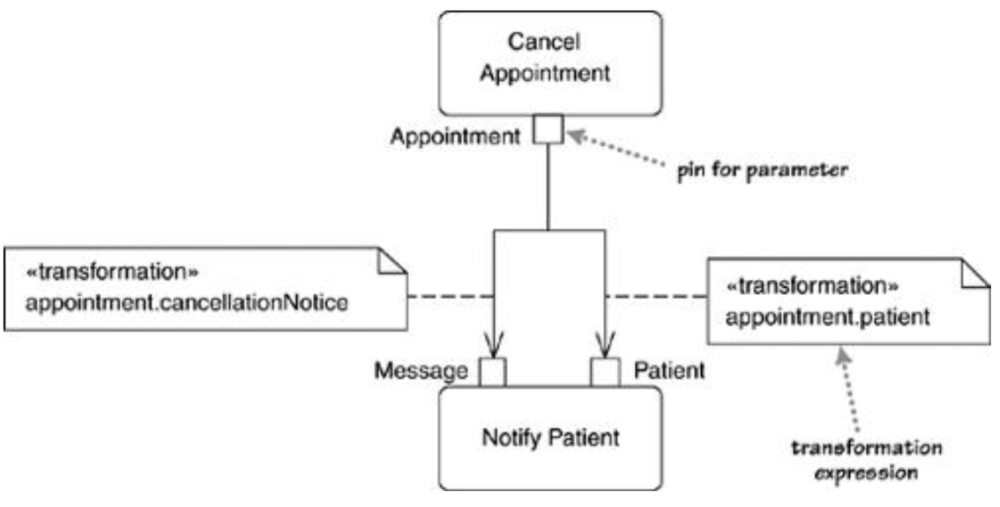
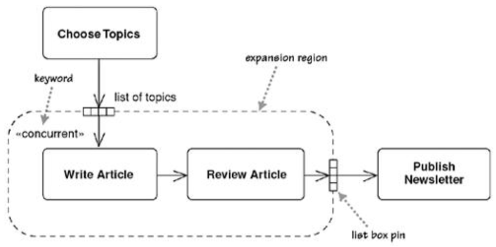
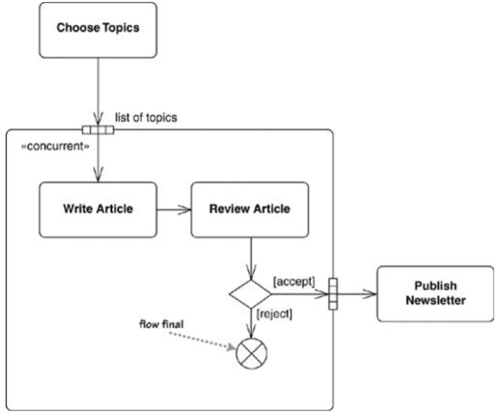
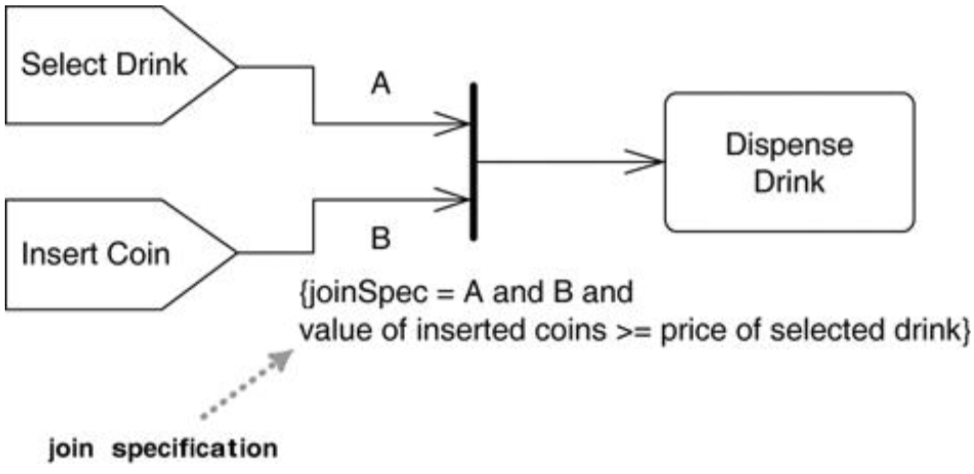

# 活动图Activity Diagrams

[可供参考的博客](https://www.cnblogs.com/xiaolongbao-lzh/p/4591953.html)

* 用于描述程序逻辑、业务流程和工作流程
* 和流程图类似，但额外支持并行行为

## 一、基本概念

* 初始节点initial node：活动图的开始 - 使用实心圆表示
* 活动结束节点activity final：活动图的结束 - 使用实心圆+圆环表示
* 行为action：活动是一个行为序列 - 使用圆角矩形表示
* 并发行为 - 使用粗线表示
  * 分岔fork：接收一个输入流，有多个并发输出流
  * 汇合join：当多个并发输入流均执行到此时，才执行输出流
* 条件行为 - 使用菱形表示
  * 决策decision：接收一个输入流，有多个被gurad限定的输出流，只挑选一个执行
    * guard：布尔条件，用于判断执行哪一个输出流（各个gurad必须互斥）
  * 合并merge：接收多个输入流，输出一个输出流，标识着条件行为的结束

## 二、分解一个动作Decomposing an Action

* 行为可以被分解为子活动
  * 通过**子活动图**实现 -> 通过耙标记rake symbol说明使用了子活动图
  * 通过类上的方法实现 -> 通过`class- name::method-name`指明方法调用

## 三、划分Partitions

* 想法：想要进一步说明每个行为action具体由谁负责执行
* 思路：将活动图划分成不同部分，并标记每个部分由谁负责
  * 可以在横竖两个方向划分 - 二维格线

## 四、信号Signals

* 信号signal：活动接收到的**来自外部进程的事件**
  * 动作可以发送信号send signal - 使用右凸四边形表示
  * 动作也可以响应信号receive signal -  使用左凹四边形表示 
* 时钟信号time signal：使用沙漏标志表示

## 五、Tokens

可以想象初始状态创造了一个token，然后此token在活动图中流动，不断有token被消费和产生

## 六、流和边Flows and Edges

* 流/边：两个动作之间的连接，有以下四种表示方式：
  * 简单的箭头表示
  * 连接器connector：当遇到很难画的线时，可以使用连接器（尽量少用）
    * 成对出现，并拥有相同的标签label
  * 对象节点object node：充当token的角色并传递数据 - 使用类框表示
  * 引脚pin：详见“七”

## 七、引脚和类型转换Pins and Transformations

* 引脚pin：用于显式说明动作的参数 - 使用小方框表示
  * 有输入参数和输出参数
  * 使用引脚后能够安全的表示多个流进入同一动作，相当于**隐式的汇合join**
* 类型转换transformation：一般来说动作的输出参数应该和下一个动作的输入参数相匹配，但是可通过指定一个无副作用的转换来解决参数不匹配的问题
  * 通过注释说明转换规则
  * 转换必须是一个无副作用的表达式

## 八、扩展区域Expansion Regions

* 问题：一个行为的输出会触发另一个行为的多次调用
* 思路：使用扩展区域标记活动图中的一个区域，对列表中的每个项目执行该区域中的行为
  * 扩展区域expansion region：使用圆角虚线矩形框出
  * 列表框引脚list box pin：使用多个引脚来表示列表（一般画4个即可）
  * `«concurrent»`关键字：表示对列表中的元素并行执行扩展区域中的行为
* 扩展
  * 扩展区域可以起到过滤器的作用，即输出集合比输入集合小（使用流结束节点销毁token）
  * 单个行为的简化版本
    * 

## 九、流结束节点Flow Final

* 表示一个流程的结束（注意和活动结束节点区分，和整个活动无关）
* 使用圆圈+叉表示

## 十、自定义汇合的规则Join Specifications

* 定义：附加给汇合join的布尔表达式
  * 每当一个token到达时就会判定一次
  * 当且仅当表达式为true时才释放输出token
  * 注意：给每个流添加标签，然后将标签加入joinSpec表明需要接收所有token

## 十一、使用场景When to Use Activity Diagrams

* 支持并鼓励并行行为
* 适用于工作流work flow建模