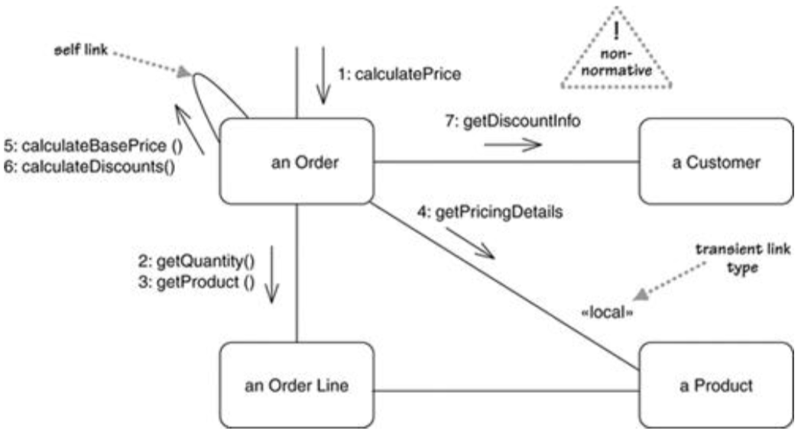
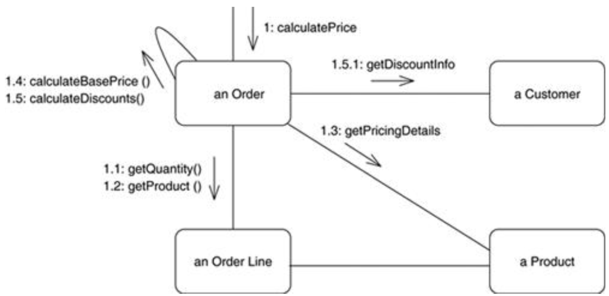

# 通信图Communication Diagrams

别名：协作图collaboration diagrams

* 强调交互中各个参与者间的数据连接
* 通过编号来标记消息的顺序

## 一、基本概念

* 链接link
  * 关联的实例
  * 临时链接transient link：只出现在交互的上下文中
    * `«local»`关键字：表示局部变量
    * `«parameter»`关键字
    * `«global»`关键字
* 编号方式
  * 扁平编号：按顺序使用数字编号
  * 嵌套十进制编号nested decimal numbering：使用.表示嵌套关系
    * 消除自我调用的歧义性
* 字母letter：用于区分不同的线程（如A5、B2就在不同的线程中运行）

## 二、使用场景When to Use Communication Diagrams

* 通信图 vs. 序列图：完全基于个人喜好（一般推荐使用序列图）
* 适合探索交互的多重选择 -> 不如使用CRC card

