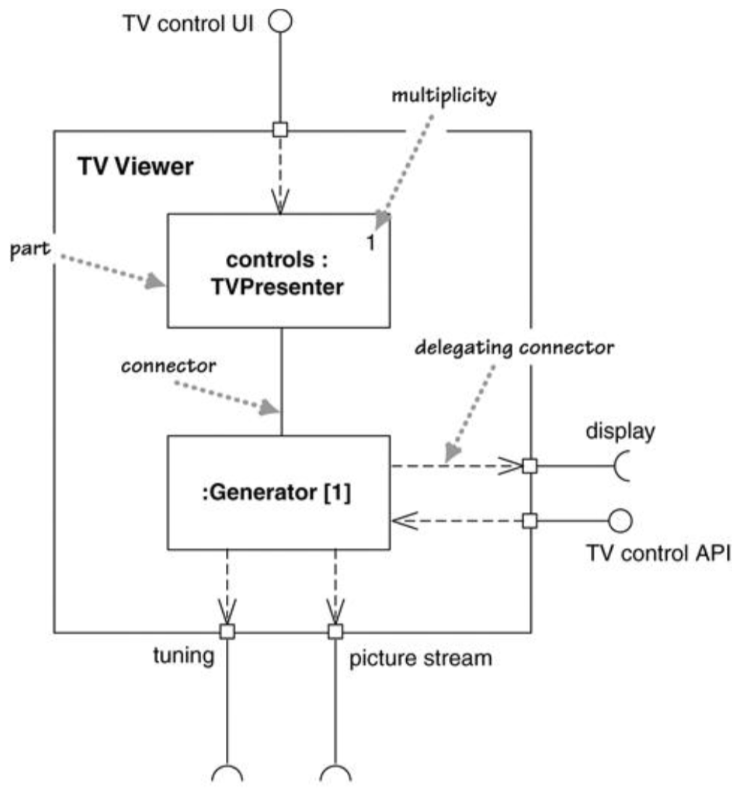
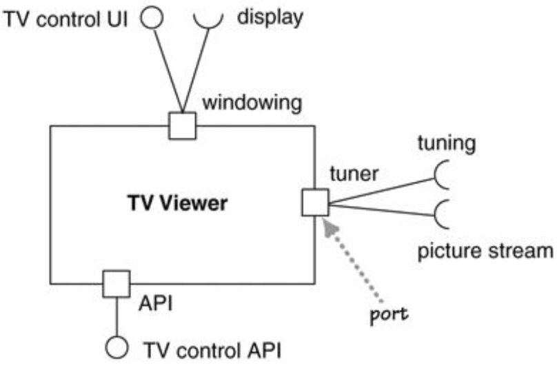

# 组合结构Composite Structures

* 将一个类分解成内部结构，即将一个复杂对象分解成不同的部分

## 一、基本概念

* 部分part：`<name> <:class>`
  * 使用粗体表示（由于不是实例，所以不使用下划线）
* 多重性multiplicity：一个部分有多少个实例
* 连接器connector：用于表示个部分间的关系
  * 使用直线或ball-and-socket标注
* 委派连接器delegating connector：用于表示接口和各部分间的对应关系
  * 需要一个接口：虚线鱼骨箭头指向外侧接口（依赖）
  * 实现一个接口：从外侧接口使用虚线鱼骨箭头指向各部分（被依赖）
* 端口port：将组件所需和提供的接口按照逻辑交互的方式组织
  * 

## 二、使用场景When to Use Composite Structures

* 包图 vs. 组合结构图
  * 包图：编译时期
  * 组件结构图：运行时期