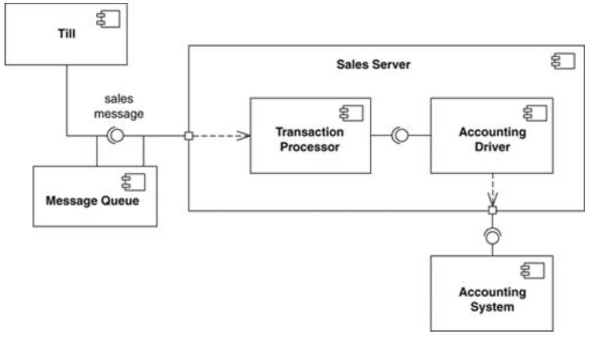
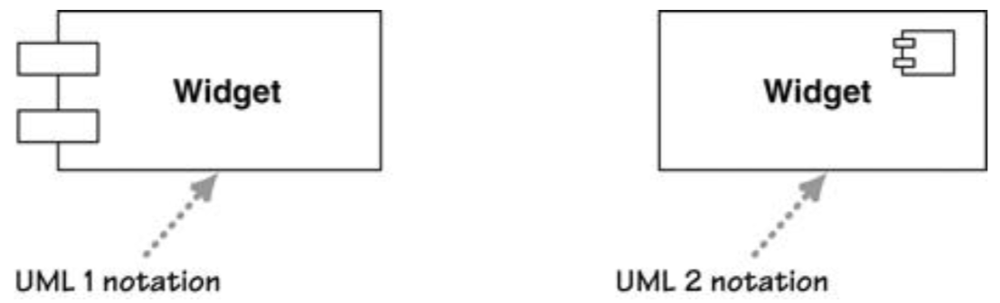

# 组件图Component Diagrams

## 一、基本概念

* 组件的UML表示
  * 专门的组件符号（如下图右边）
  * `«component»`关键字
  * 
* 和类图一样使用ball-and-socket notation方式来表示需要和提供的接口
* 可通过组合结构图分解组件

### 1.1、组件和普通类的区别component vs. regular class

* 从用户的视角看待软件，一个组件是软件中能够被单独购买和更新的一部分
* 一个组件即一个能够被单独购买的部分
* 新组件能够和旧组件共同工作
* 来自不同制造商的组件能够被相互组合

## 二、使用场景When to Use Component Diagrams

* 将系统划分为组件并希望通过接口显示组件间相互关系时