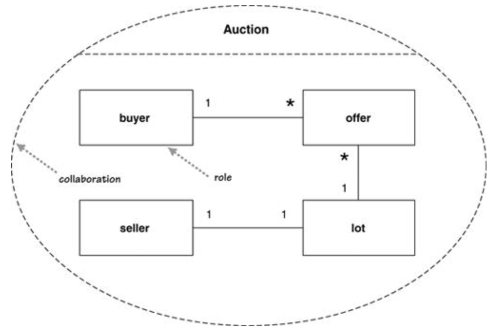
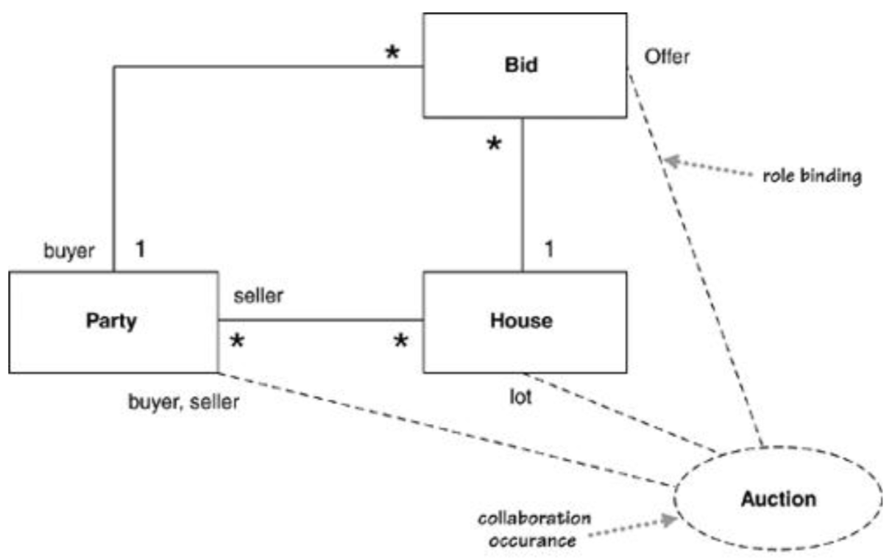

# 协作Collaborations

* 不是UML 2中的官方视图
* 在标准UML中，**协作是组合结构图的一部分**

## 一、基本概念

* 协作collaboration：使用虚线椭圆表示
* 角色role：和类对应，但不是类（一个类可以充当多个角色）
  * 粗体 + 小写（注意类需要首字母大写）
  * 格式：`<participant-name> </role-name> <:class-name>`

## 二、协作和类图

* 协作的出现collaboration occurrence：用于标明协作的存在
* 角色绑定role binding：使用虚线连接类和协作，并在靠近类的一侧表示标上该类所扮演的角色，若有多个角色则使用逗号隔开

## 三、使用场景When to Use Collaborations

* 适用于类扮演不同角色时使用
* 用处不大