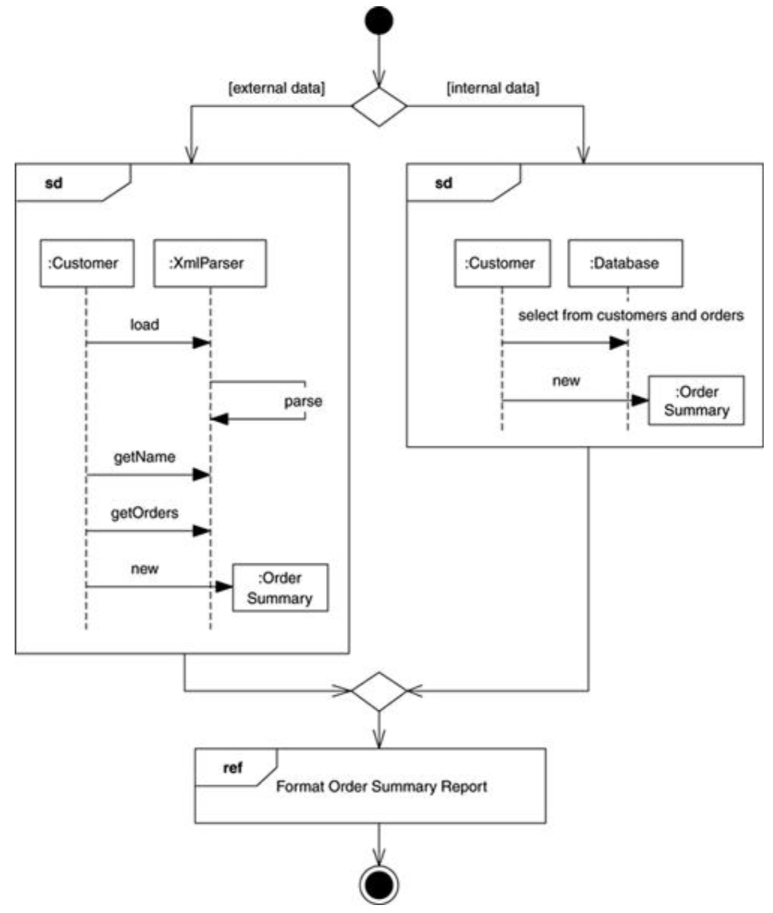

# 交互概述图Interaction Overview Diagrams

* 将活动图和序列图融合起来

## 一、基本概念

* 使用小序列图代替活动图中的行为action
* 操作符
  * sd：用于包裹整个序列图
  * ref：指向另一个序列图

## 二、使用场景When to Use Interaction Overview Diagrams

* 两种图尚未能够较好的融合在一起，没必要使用