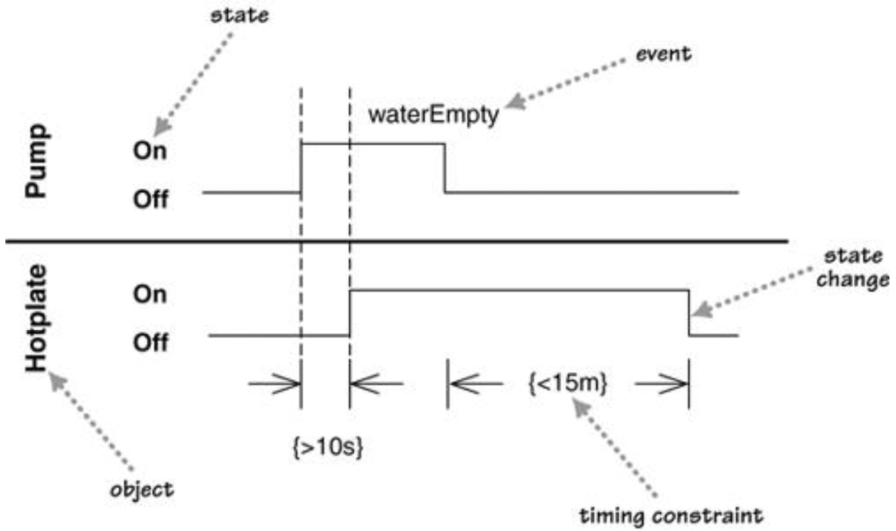
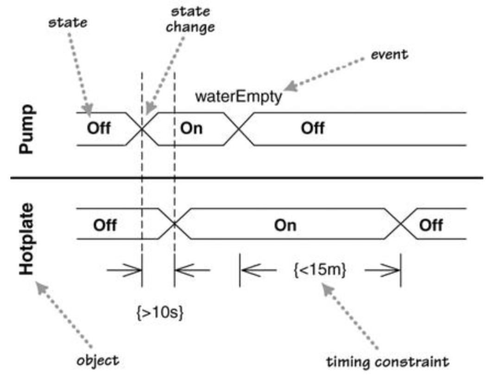

# 时序图Timing Diagrams

* 交互图的一种形式，重点在于时间约束

## 一、基本概念

* 对象object：拥有状态的实例
* 事件event：触发状态转换
* 时间约束timing constraint：用于说明需要满足的事件限制
  * 格式：`{timing-constraint}`
  * 虚线：可选，用于辅助说明时间约束的事件是哪一个

### 1.1、用线表示状态

* 状态state：使用水平线表示
* 状态变化state change：从一个水平线变化到另一个水平线
* 适用场景：状态较少的场合

### 1.2、用区域表示状态

* 状态state：使用区域表示，标记在区域上
* 状态变化state change：区域的交叉
* 适用场景：状态较多的场合

## 二、使用场景When to Use Timing Diagrams

* 适用于显示不同对象状态变化间的时间约束